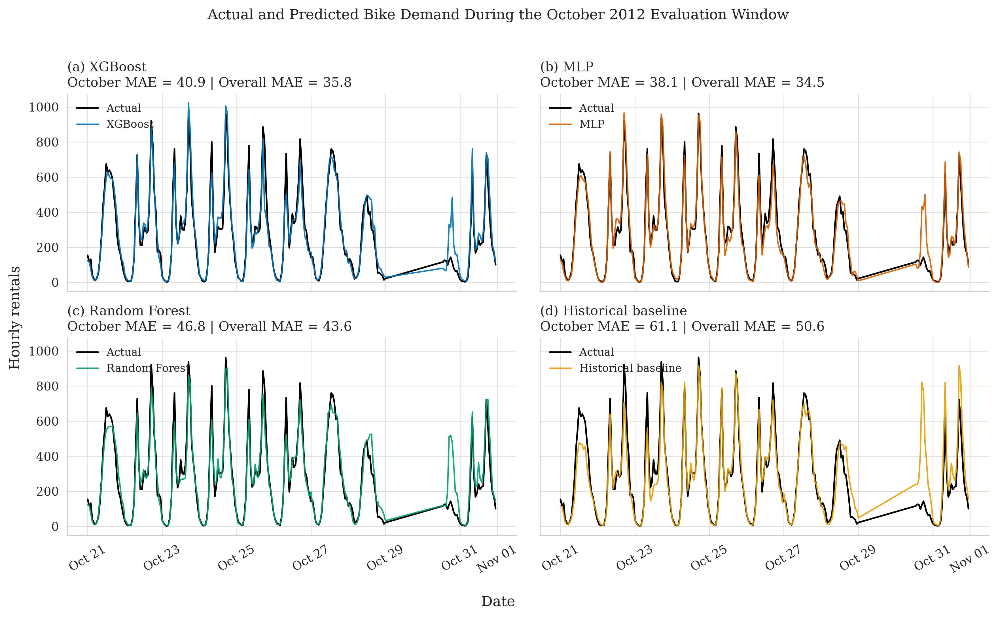
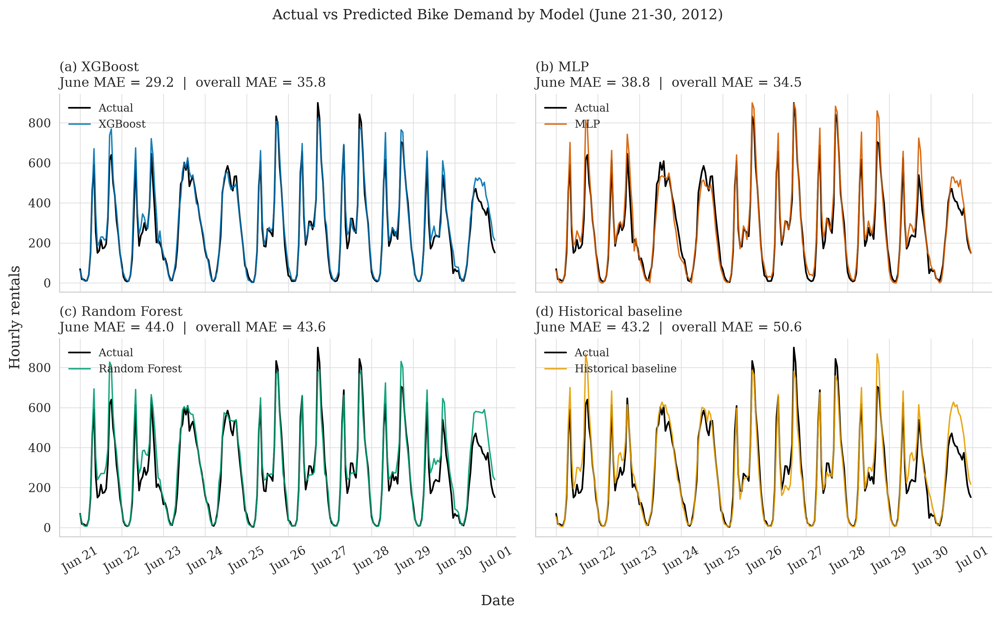
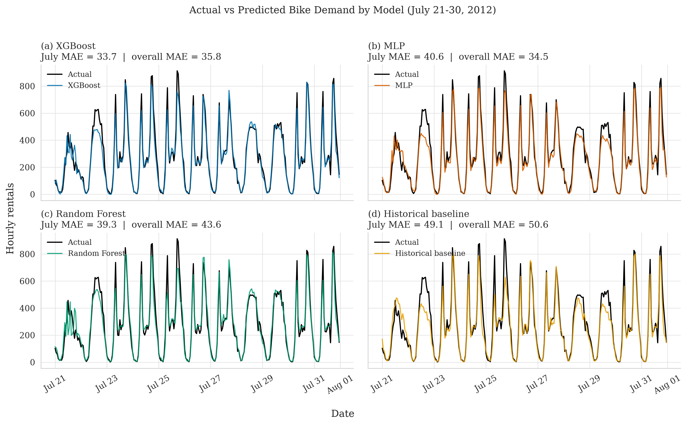
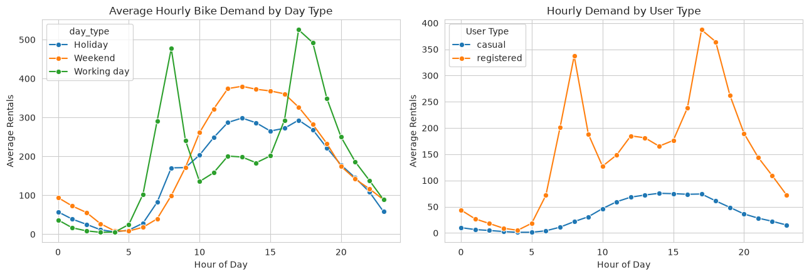
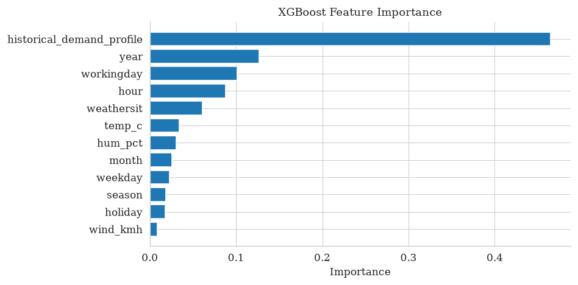

# Capital Bikeshare Demand: Analysis & Forecasting

Two years of hourly Capital Bikeshare (Washington, D.C.) rental data, analyzed end to end: what
drives demand, how weather and rider type interact, and how well demand can be forecast a few weeks
out using only information available at prediction time.


*Held-out October 2012 test window — the MLP (top right) tracks the bimodal commuter peaks closely
while the historical baseline (bottom right) collapses during an irregular late-month spike.*

<details>
<summary>Two more monthly windows (June, July 2012) — click to expand</summary>




Performance holds up outside October too: XGBoost/MLP track actual demand closely across very
different seasonal patterns, not just one favorable window.
</details>

## Highlights

- **17,379 hourly records**, Jan 2011–Dec 2012, no missing values.
- Diagnosed severe overdispersion in the target (variance ≈ 174× the mean) → used **Negative Binomial
  regression** instead of Poisson, with VIF-based multicollinearity checks.
- Forecast hourly demand for the **21st–end of every month**, training only on days 1–20, with a
  leakage-safe feature (`historical_demand_profile`) that only ever looks at *past* calendar-aligned
  demand.
- Compared **4 models** (historical baseline, Random Forest, XGBoost, MLP) across all 24 monthly test
  windows — not just a single train/test split.

## Key results

**Regression** (rate ratios, all p < 0.001 unless noted):

| Effect | Rate Ratio |
|---|---|
| Temperature +10°C | 1.37 |
| Light rain/snow vs. clear | 0.60 |
| Working day vs. weekend | 0.82 |
| 2012 vs. 2011 (YoY growth) | 1.60 |

Casual riders are far more weather-sensitive than registered riders (+91% vs. +29% demand per 10°C)
and strongly avoid working days — registered trips read as inelastic commuting, casual trips as
discretionary leisure.

**Forecasting** (aggregated across all 24 monthly test windows):

| Model | MAE | RMSE | RMSLE |
|---|---|---|---|
| Historical baseline | 50.57 | 88.69 | 0.57 |
| Random Forest | 43.58 | 72.65 | **0.52** |
| XGBoost | 35.80 | 61.49 | 0.53 |
| MLP (128, 64) | **34.48** | **56.78** | 0.58 |

The MLP wins on absolute error (best MAE/RMSE in 19 of 24 windows); Random Forest is more reliable on
*relative* error at low-volume hours (best RMSLE) — worth knowing since which metric matters depends
on whether under-forecasting a quiet 3am hour or a packed 5pm rush hour costs you more.



## Why the forecast is trustworthy (not just accurate)

- `casual`/`registered` are excluded from the feature set — they're literal components of the target
  (`count = casual + registered`), so using them would leak the answer.
- The training window for every test period is strictly *before* it — no future weather, no future
  demand, ever crosses into a feature.
- `historical_demand_profile`, the strongest feature by a wide margin, is built by matching each
  forecast hour to the closest **prior** calendar-aligned demand, falling back through
  month-weekday-hour → month-hour → hour-only history if an exact match isn't available yet.



## Repo structure

```
.
├── bikeshare_forecasting.ipynb   # full analysis, runs top to bottom
├── images/                       # plots referenced in this README
├── requirements.txt
└── .gitignore
```

## Running it

```bash
pip install -r requirements.txt
jupyter notebook bikeshare_forecasting.ipynb
```

Dataset: [UCI Bike Sharing Dataset](https://archive.ics.uci.edu/dataset/275/bike+sharing+dataset)
(Fanaee-T & Gama, 2013). Update the data path near the top of the notebook to point at your local copy.

## Data note

This analysis encodes `season` as 1=Spring, 2=Summer, 3=Fall, 4=Winter, which differs from the UCI
repository's own documentation (1=Winter). That schema is kept consistent throughout — worth knowing
if you're cross-referencing coefficients against the raw UCI docs.

## Limitations / next steps

- Weather features are treated as perfectly known at forecast time; a deployed system would need to
  substitute actual weather *forecasts*, which carry their own error.
- Error is highest in Nov–Dec (holiday-season demand volatility) — calendar and weather features alone
  don't fully capture that.
- The MLP borrows XGBoost's feature-importance ranking as an interpretability proxy, since neural nets
  don't expose one natively; this is reasonable given the two models achieve comparable RMSE, but it's
  an approximation, not a direct explanation of the MLP itself.

---
Muminul Hoque · [GitHub](https://github.com/Muminul-Hoque)
